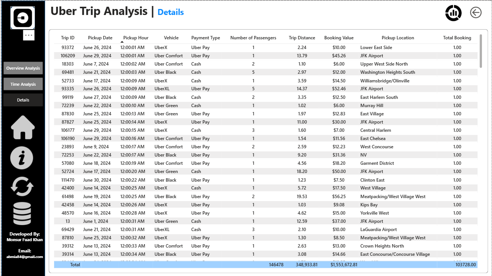

# Uber Trip Analysis – Power BI Dashboard

An interactive Power BI report that analyses Uber trip data: how many bookings are made, how much revenue they generate, where and when trips happen, and which vehicles and payment methods customers prefer.

## Dashboard Preview

### Overview Analysis


### Time Analysis


### Details


## Project Structure

```
Uber-Trip-Analysis/
├── Uber Trip Analysis.pbix        # Power BI report (open in Power BI Desktop)
├── README.md
├── Dashboard/                     # Screenshots of each report page
│   ├── Overview Analysis.png
│   ├── Time Analysis.png
│   └── Details.png
└── Uber Data/
    ├── Uber Trip Details.xlsx     # Trip-level data (fact table)
    ├── Location Table.xlsx        # Location lookup table
    ├── Problem Statement.docx     # Business questions the project answers
    └── Images/                    # Icons/logos used in the report design
        └── (Uber Logo, Home, Info, Refresh, Data, car icons, clock, etc.)
```

## Report Pages

### 1. Overview Analysis
- **KPI cards:** Total Booking, Total Booking Value, Average Booking Value, Total Trip Distance, Average Trip Distance, Average Trip Time
- **Payment type** share (donut chart)
- **Day vs Night** trips (donut chart)
- **Vehicle summary** table (bookings, booking value, average value, distance)
- **Booking trend** over time (area chart)
- **Top locations** by bookings (bar chart)
- **Most preferred vehicle** per pickup location
- Highlights: most frequent pickup/drop-off point and farthest trip
- Slicers: **Date**, **City**, and a **Dynamic Measure** switcher

### 2. Time Analysis
- Trip distance by **pickup hour**
- Trip distance by **day of week**
- Hour × Day matrix to spot peak demand periods

### 3. Details
- Trip-level table: Trip ID, pickup date/hour, location, vehicle, payment type, passenger count, booking value and distance

## Data Sources

| File | Location | Purpose |
|---|---|---|
| Uber Trip Details.xlsx | `Uber Data/` | One row per trip |
| Location Table.xlsx | `Uber Data/` | Pickup/drop-off location lookup |
| Problem Statement.docx | `Uber Data/` | Project objectives and questions |

## Data Model

| Table | Purpose |
|---|---|
| `Trip Details` | Fact table with one row per trip |
| `Location Table` | Pickup/drop-off location lookup |
| `calender_table` | Date dimension (day name, etc.) |
| `Dynamic Measure` | Disconnected table to switch the displayed metric |

## How to Open
1. Install [Power BI Desktop](https://powerbi.microsoft.com/desktop/) (Windows).
2. Download the whole repository (**Code → Download ZIP**) and extract it.
3. Open `Uber Trip Analysis.pbix`.
4. If Power BI cannot find the data, go to **Home → Transform data → Data source settings** and point the two Excel sources to the files in `Uber Data/`.

## Tools Used
- Power BI Desktop
- DAX (measures and calculated columns)
- Power Query (data preparation)
- Excel (source data)

## Author
**Monsur Fuad** – [GitHub](https://github.com/MonsurFuad)
